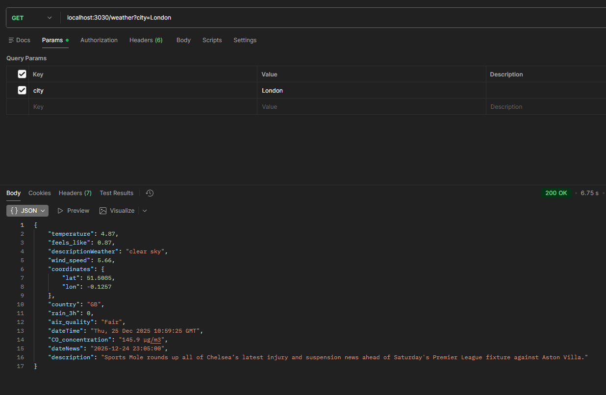
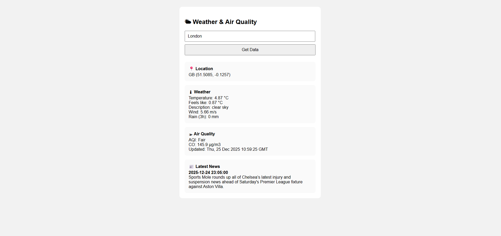

# Weather & News Application

A full-stack web application that provides real-time weather information, air quality data, and latest news based on city location.

## Features

- 🌤 **Real-time Weather Data**: Temperature, feels-like temperature, weather description, wind speed, and rain volume
- 🌫 **Air Quality Monitoring**: AQI levels and CO concentration
- 📰 **Latest News**: Location-based news in the local language
- 🗺 **Geographic Information**: Coordinates and country information
- 📱 **Responsive Design**: Works seamlessly across different devices

## Technologies Used

### Backend
- **Node.js** with Express.js
- **OpenWeather API** - Weather and air quality data
- **NewsData.io API** - Latest news articles
- **REST Countries API** - Country information and language detection

### Frontend
- HTML5
- CSS3
- Vanilla JavaScript (Fetch API)

## Prerequisites

Before running this application, ensure you have:

- Node.js (v14 or higher)
- npm (Node Package Manager)
- API Keys from:
  - [OpenWeather API](https://openweathermap.org/api)
  - [NewsData.io](https://newsdata.io/)

## Installation

1. **Clone the repository**
   ```bash
   git clone "https://github.com/silence99999/webTech2"
   ```

2. **Install dependencies**
   ```bash
   npm install
   ```

3. **Create environment file**

   Create a `.env` file in the root directory:
   ```
   API_KEY_WEATHER=your_openweather_api_key
   API_KEY_NEWS=your_newsdata_api_key
   ```

4. **Start the server**
   ```bash
   node assignment2/index.js
   ```

5. **Access the application**

   Open your browser and navigate to: `http://localhost:3030`

## API Endpoints

### GET /weather
Retrieves weather, air quality, and news data for a specified city.

**Query Parameters:**
- `city` (optional): City name (default: "Astana")

**Example Request:**
```
GET http://localhost:3030/weather?city=London
```

**Example Response:**

```

## Project Structure

```
assignment2/
├── server.js              # Express server and API logic
├── public/
│   └── index.html        # Frontend interface
├── .env                  # Environment variables (not in repo)
├── package.json          # Dependencies
└── README.md            # Documentation


## Key Design Decisions

### 1. Server-Side API Integration
All third-party API calls are handled on the backend to:
- Protect API keys from exposure
- Reduce client-side complexity
- Enable data processing and aggregation
- Improve security and performance

### 2. Multi-API Data Aggregation
The application intelligently combines data from multiple sources:
- **OpenWeather API**: Weather and air quality data using coordinates
- **REST Countries API**: Automatic language detection for news localization
- **NewsData.io**: Localized news based on country and language

### 3. Air Quality Index Mapping
AQI values are converted from numeric (1-5) to descriptive labels:
- 1 → Good
- 2 → Fair
- 3 → Moderate
- 4 → Poor
- 5 → Very Poor

### 4. Language Detection
The app automatically detects the primary language of the searched country and fetches news in that language, with fallback to English.

### 5. Error Handling
Comprehensive try-catch blocks ensure graceful error handling and informative error messages to users.

## Screenshots

### Main Interface


*Screenshot showing weather data, air quality, and news for London*

## Dependencies

```json
{
  "express": "^4.18.0",
  "dotenv": "^16.0.0"
}
```
