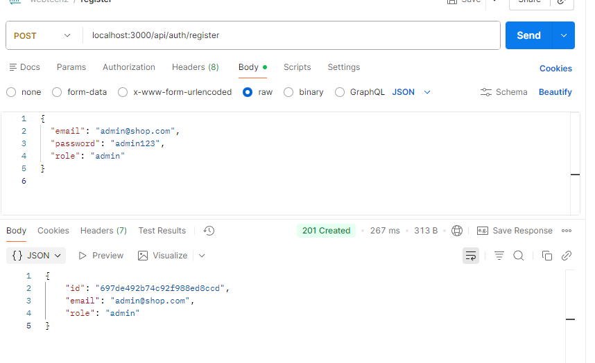
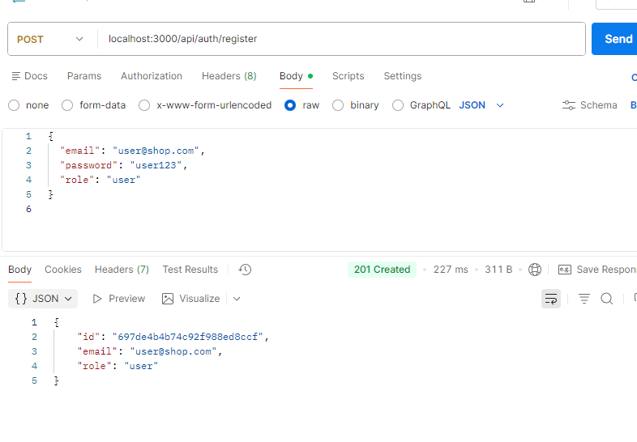
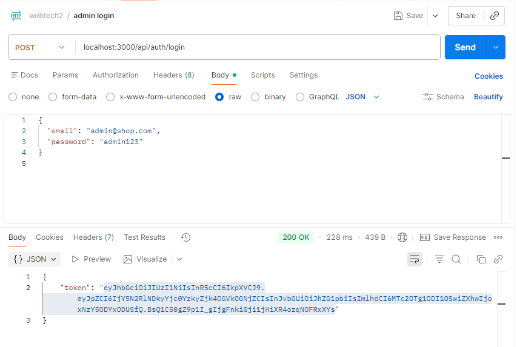
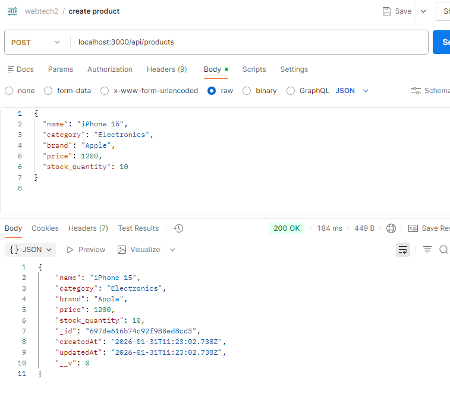
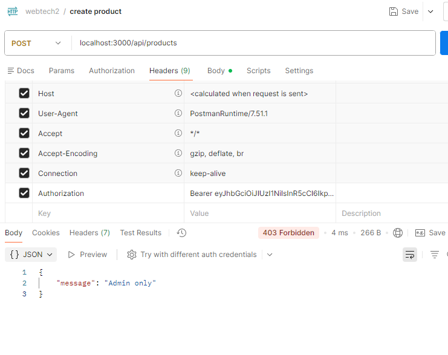
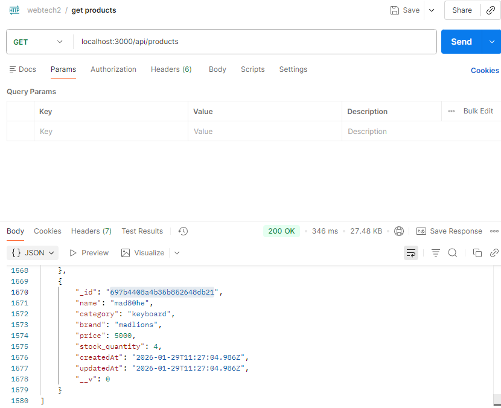
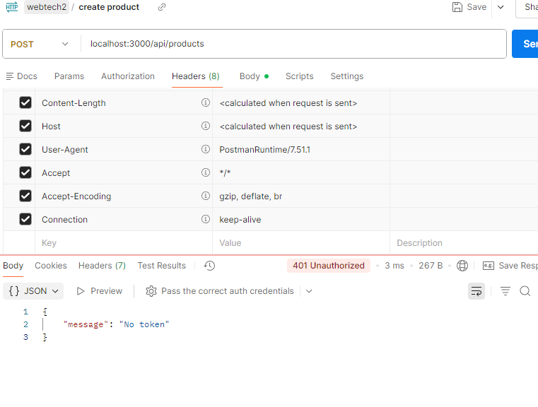

# 🛒 Online Shop API

## 📌 Project Overview

This project is a **RESTful API for an Online Shop** built with **Node.js, Express, and MongoDB**, following the **MVC (Model–View–Controller)** architecture.

The API implements:
- Modular MVC project structure
- JWT-based authentication
- Password hashing using bcrypt
- Role-Based Access Control (RBAC)
- Full CRUD operations for multiple related objects

---

## 🧱 Project Architecture (MVC)
```text
config/ → Database configuration
models/ → Mongoose schemas
controllers/ → Business logic
routes/ → API endpoints
middleware/ → Authentication & authorization
server.js → Application entry point
```

This separation improves **maintainability, scalability, and security**.

---

## 🧩 Data Models (Objects)

### 1️⃣ Product (Primary Object)

Represents items sold in the online shop.

**Fields:**
- name
- category
- brand
- price
- stock_quantity

**Operations:**
- Create (admin only)
- Read (public)
- Update (admin only)
- Delete (admin only)

---

### 2️⃣ Order (Secondary Object)

Represents a purchase made by a customer.

**Fields:**
- order_date
- order_status
- total_amount
- customer_id (reference to Customer)
- order_items (references Product)

Each order is linked to a customer and contains one or more products.

---

### 3️⃣ Customer (Business Entity)

Represents a buyer in the system.

**Fields:**
- full_name
- email
- phone
- address
- user_id (optional reference to User)

Customers are used for **orders and delivery information**.

---

### 4️⃣ User (Authentication Entity)

Represents system accounts used for authentication and authorization.

**Fields:**
- email
- password (hashed)
- role (`user` or `admin`)

Users are responsible for:
- Logging in
- Receiving JWT tokens
- Access control (RBAC)

---

## 🔐 Authentication & Role-Based Access Control (RBAC)

### Authentication
- Passwords are hashed using **bcrypt**
- Users log in and receive a **JWT token**
- JWT is required for protected routes

### Roles
- **User**
    - Can log in
    - Can access protected read routes
- **Admin**
    - Can create, update, and delete products, customers, and orders

### Access Rules Summary

| Action | User | Admin |
|------|------|-------|
Read (GET) | ✅ | ✅ |
Create (POST) | ❌ | ✅ |
Update (PUT) | ❌ | ✅ |
Delete (DELETE) | ❌ | ✅ |

---

## ⚙️ Setup Instructions

### Install dependencies
```bash
npm install
```
### Create .env file
```bash
PORT=3000
MONGO_URI=mongodb://localhost:27017/online_shop
JWT_SECRET=your_secret_key_here
```
### Run the server
```bash
node server.js
```
Server will run at:
```text
http://localhost:3000
```
## API Testing (Postman)
All API endpoints were tested using Postman to verify:

Authentication

Authorization

Role-based restrictions

CRUD functionality

Postman Screenshots

🔹 User Registration


🔹 User Login (JWT Token)

🔹 Admin Creating Product (Allowed)

🔹 User Creating Product (Forbidden)

🔹 Orders with Populated Data

🔹 Unauthorized Access (No Token)

